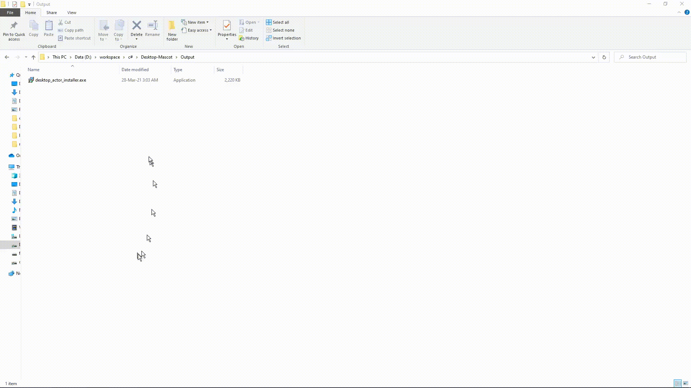

[Download!](https://github.com/Kahdeg-15520487/Desktop-Mascot/releases/latest)

# What does it do?
It's simple software that gives you a desktop buddy to play with and enjoy! All of which in addition to the animations will be easily customizable.

# Features
- Actor character with physics to throw around.
- Easily replace actor with custom one.
- Basic animation state machine.

### Latest update
**1.0: Under new management**
- Rewrite how configuration work (currently still hardcoding sprite composition, custom scene is not yet available)
- Simulate collision between sprite
**old-2.0**
- Finished complete rewrite.
- Basic animation state machine.
- Added context menu to allow exiting and enabling/disabling some features.
- Modified physics to lessen deceleration and consequently increase slide.
